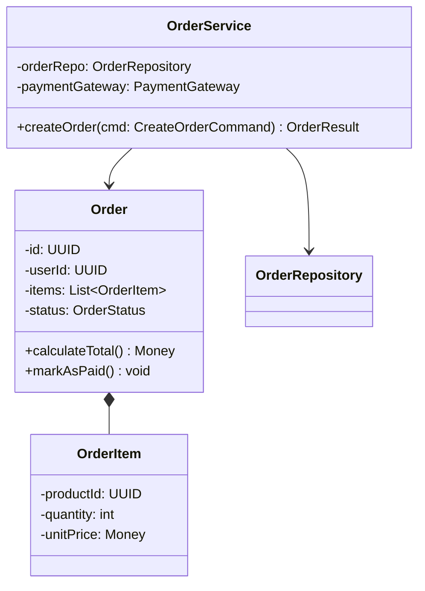
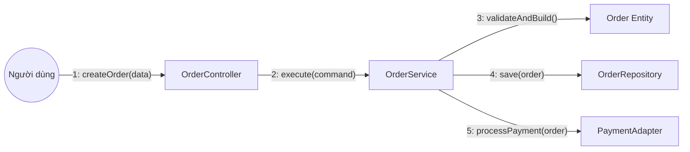
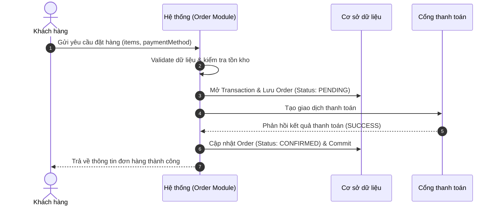

# Tài liệu Phân tích Thiết kế Hệ thống (System Analysis & Design Document)

> **Tên Module:** [Tên Module]  
> **Dựa trên User Story:** [Đường dẫn đến file User Story liên quan]  
> **Tác giả:** [Tên tác giả / Antigravity]  
> **Ngày:** [YYYY-MM-DD]  
> **Trạng thái:** [Draft / Approved]  

---

## PHẦN A: LIỆT KÊ VÀ PHÂN TÍCH CÁC CHỨC NĂNG CHÍNH

| STT | Mã Chức năng | Tên Chức năng | Vai trò & Mục đích |
| :---: | :--- | :--- | :--- |
| 1 | `FUNC-01` | [Tên chức năng 1, vd: Đăng ký tài khoản] | [Mô tả ngắn gọn vai trò của chức năng trong module] |
| 2 | `FUNC-02` | [Tên chức năng 2, vd: Xác thực OTP] | [Mô tả ngắn gọn vai trò của chức năng trong module] |
| 3 | `FUNC-03` | [Tên chức năng 3, vd: Cập nhật hồ sơ] | [Mô tả ngắn gọn vai trò của chức năng trong module] |

---

## PHẦN B: CHI TIẾT TỪNG CHỨC NĂNG CHÍNH

*(Lặp lại cấu trúc dưới đây cho từng chức năng chính `FUNC-01`, `FUNC-02`,...)*

### Chức năng: [FUNC-01] - [Tên chức năng]

#### 1. Các kịch bản Usecase
* **Tên usecase (Usecase Name):** [Tên usecase, vd: Đặt hàng thanh toán online]
* **Tác nhân (Actor):** [Người dùng / Cron Job / Admin / External Webhook]
* **Tiền điều kiện (Pre-conditions):**
  * [Điều kiện bắt buộc phải thỏa mãn trước khi thực hiện usecase]
  * [Ví dụ: Người dùng đã đăng nhập, giỏ hàng có ít nhất 1 sản phẩm]
* **Hậu điều kiện (Post-conditions):**
  * [Trạng thái của hệ thống sau khi usecase hoàn thành]
  * [Ví dụ: Đơn hàng ở trạng thái PENDING, email xác nhận đã gửi, tồn kho giảm]
* **Kịch bản hoạt động (Basic Flow - Happy Path):**
  1. Tác nhân gửi yêu cầu thực hiện chức năng kèm payload dữ liệu.
  2. Hệ thống kiểm tra tính hợp lệ của dữ liệu đầu vào.
  3. Hệ thống kiểm tra quyền và các ràng buộc nghiệp vụ.
  4. Hệ thống thực hiện cập nhật trạng thái các thực thể và lưu vào cơ sở dữ liệu.
  5. Hệ thống gửi thông báo hoặc sự kiện liên quan (nếu có).
  6. Hệ thống phản hồi kết quả thành công cho tác nhân.
* **Các trường hợp đặc biệt & Ngoại lệ (Edge cases & Exception Flows):**
  * **Ngoại lệ 1 (Dữ liệu không hợp lệ):** Trả về mã lỗi 400 kèm chi tiết trường dữ liệu sai.
  * **Ngoại lệ 2 (Vi phạm ràng buộc tồn kho/số dư):** Trả về mã lỗi 422, huỷ bỏ transaction, thông báo người dùng.
  * **Ngoại lệ 3 (Lỗi kết nối cổng thanh toán thứ ba):** Đưa vào hàng đợi thử lại (Retry Queue), chuyển đơn sang trạng thái chờ xử lý.

---

#### 2. Phân tích Thực thể (Entity Analysis)

* **Các thực thể tham gia trong usecase:**
  * `[Entity 1]`: [Mô tả trách nhiệm của thực thể]
  * `[Entity 2]`: [Mô tả trách nhiệm của thực thể]
* **Mối quan hệ giữa các thực thể (Relationships):**
  * `[Entity 1]` có quan hệ 1-N với `[Entity 2]`.
* **Bảng cơ sở dữ liệu tương ứng (Database Tables Mapping):**
  * `[table_name_1]`: Chứa các trường `id`, `user_id`, `status`, `created_at`...
  * `[table_name_2]`: Chứa các trường `id`, `parent_id`, `amount`, `metadata`...

* **Biểu đồ phân tích lớp (Class Diagram):**

* **Biểu đồ truyền thông (Communication Diagram):**

---

#### 3. Tổng hợp kịch bản

* **User Story hoàn chỉnh:**
  > Là một **Khách hàng**, tôi muốn **hoàn tất thanh toán đơn hàng trực tuyến** để **hàng hoá được giao tới địa chỉ của tôi**.

* **Biểu đồ tuần tự hệ thống (System Sequence Diagram - SSD):**

---

## PHẦN C: LỰA CHỌN MẪU THIẾT KẾ (DESIGN PATTERNS)

Dưới đây là các mẫu thiết kế được đánh giá và đề xuất áp dụng cho bài toán này:

### 1. [Tên Mẫu thiết kế 1, vd: Strategy Pattern]
* **Mục đích áp dụng:** [Ví dụ: Cho phép linh hoạt hoán đổi giữa các phương thức thanh toán Momo, VNPay, Stripe mà không sửa code chính].
* **Phân tích Ưu điểm:**
  * Tuân thủ triệt để nguyên tắc Open/Closed (thêm cổng mới chỉ cần thêm class mới).
  * Giảm độ phức tạp của các câu lệnh `if-else` / `switch-case` lồng nhau.
  * Dễ dàng viết Unit Test độc lập cho từng phương thức.
* **Phân tích Nhược điểm:**
  * Tăng số lượng class trong codebase.
  * Tầng gọi cần biết hoặc có Factory để inject đúng chiến lược (Strategy) phù hợp.

### 2. [Tên Mẫu thiết kế 2, vd: Factory Method Pattern]
* **Mục đích áp dụng:** [Ví dụ: Khởi tạo đối tượng Notification Handler tuỳ theo loại thông báo (Email, SMS, Push Notification)].
* **Phân tích Ưu điểm:**
  * Tập trung logic khởi tạo đối tượng tại một nơi duy nhất.
  * Che giấu sự phức tạp của việc cấu hình các instance.
* **Phân tích Nhược điểm:**
  * Có thể gây dư thừa lớp nếu các loại đối tượng ít biến thể.

### 3. Kết luận Lựa chọn
* **Mẫu thiết kế được chốt sử dụng:** [Nêu tên và lý do chốt phương án].
