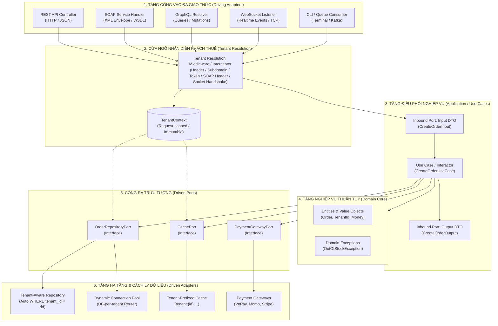

# Hướng dẫn Kiến trúc Đa Giao thức (Multi-Protocol) & Đa Khách thuê (Multi-Tenancy)

Tài liệu này cung cấp hướng dẫn thiết kế và triển khai chuẩn mực cho các hệ thống:
1. **Tách rời tầng nghiệp vụ (Core Business)** độc lập tuyệt đối với giao thức truyền tải mạng (**REST, SOAP, GraphQL, WebSocket, gRPC, Queue, CLI**).
2. **Hỗ trợ Đa khách thuê (Multi-Tenancy)** an toàn, ngăn chặn triệt để rò rỉ dữ liệu giữa các tenant.

---

## 1. Sơ đồ Kiến trúc Tổng thể (Architectural Diagram)



---

## 2. Thiết kế Tầng Ngữ cảnh Khách thuê (Tenant Context)

### A. Chiến lược Nhận diện Tenant theo từng giao thức:

| Giao thức | Vị trí nhận diện Tenant | Cách trích xuất |
| :--- | :--- | :--- |
| **REST API** | HTTP Header hoặc Subdomain | `X-Tenant-ID: org_acme` hoặc `acme.domain.com` |
| **SOAP Service** | SOAP Header XML | `<soapenv:Header><tns:TenantId>org_acme</tns:TenantId></soapenv:Header>` |
| **GraphQL** | HTTP Header Context | `request.headers['x-tenant-id']` được inject vào GraphQL context |
| **WebSocket** | Connection Handshake Query/Auth | `ws://domain.com/socket?tenant_id=org_acme` hoặc `auth.token` |
| **Queue / CLI** | Message Metadata / Command Argument | `php artisan order:process --tenant=org_acme` hoặc Kafka header `tenant_id` |

### B. Mẫu triển khai `TenantContext` (TypeScript / PHP)

```typescript
// domain/value-objects/tenant-id.vo.ts
export class TenantId {
    constructor(private readonly value: string) {
        if (!value || value.trim().length === 0) {
            throw new Error("Tenant ID cannot be empty");
        }
    }
    getValue(): string { return this.value; }
}

// application/ports/tenant-context.port.ts
export interface TenantContextPort {
    getTenantId(): TenantId;
    getTenantConfig(): Record<string, any>;
}
```

---

## 3. Thiết kế Use Case "Mù Giao thức" (Transport-Agnostic Use Case)

Use Case chỉ giao tiếp qua **Input DTO** và **Output DTO**, không chứa bất kỳ thư viện mạng nào:

```typescript
// application/dtos/create-order.dto.ts
export interface OrderItemInput {
    sku: string;
    quantity: number;
}

export interface CreateOrderInput {
    customerId: string;
    items: OrderItemInput[];
    paymentMethod: string;
}

export interface CreateOrderOutput {
    orderId: string;
    totalAmount: number;
    currency: string;
    status: string;
    createdAt: string;
}

// application/use-cases/create-order.use-case.ts
export class CreateOrderUseCase {
    constructor(
        private readonly orderRepo: OrderRepositoryPort,
        private readonly paymentGateway: PaymentGatewayPort,
        private readonly tenantContext: TenantContextPort
    ) {}

    async execute(input: CreateOrderInput): Promise<CreateOrderOutput> {
        const tenantId = this.tenantContext.getTenantId();

        // 1. Kiểm tra tồn kho & tạo Domain Entity
        const order = Order.create({
            tenantId: tenantId,
            customerId: input.customerId,
            items: input.items,
            paymentMethod: input.paymentMethod
        });

        // 2. Lưu trữ qua Port (Repository tự động áp context của tenant)
        await this.orderRepo.save(order);

        // 3. Trả về DTO thuần tuý
        return {
            orderId: order.getId(),
            totalAmount: order.getTotalAmount().getValue(),
            currency: order.getTotalAmount().getCurrency(),
            status: order.getStatus(),
            createdAt: order.getCreatedAt().toISOString()
        };
    }
}
```

---

## 4. Triển khai 4 Driving Adapters phục vụ chung 1 Use Case

### A. REST API Adapter (Express / Fastify)
```typescript
// presentation/rest/order.controller.ts
export class OrderRestController {
    constructor(private readonly createOrderUseCase: CreateOrderUseCase) {}

    async handleCreateOrder(req: Request, res: Response) {
        try {
            const input: CreateOrderInput = {
                customerId: req.body.customer_id,
                items: req.body.items,
                paymentMethod: req.body.payment_method
            };

            const result = await this.createOrderUseCase.execute(input);
            return res.status(201).json({ success: true, data: result });
        } catch (error) {
            return this.handleRestError(error, res);
        }
    }

    private handleRestError(error: any, res: Response) {
        if (error instanceof OutOfStockException) {
            return res.status(400).json({ success: false, code: "OUT_OF_STOCK", message: error.message });
        }
        return res.status(500).json({ success: false, code: "INTERNAL_ERROR" });
    }
}
```

### B. SOAP Adapter (WSDL / XML)
```typescript
// presentation/soap/order-soap.service.ts
export class OrderSoapService {
    constructor(private readonly createOrderUseCase: CreateOrderUseCase) {}

    async CreateOrder(args: any): Promise<any> {
        try {
            const input: CreateOrderInput = {
                customerId: args.CustomerId,
                items: args.Items.map((item: any) => ({ sku: item.Sku, quantity: parseInt(item.Quantity, 10) })),
                paymentMethod: args.PaymentMethod
            };

            const result = await this.createOrderUseCase.execute(input);
            return {
                CreateOrderResult: {
                    OrderId: result.orderId,
                    Total: result.totalAmount,
                    Status: result.status
                }
            };
        } catch (error) {
            // Map sang chuẩn SOAP Fault
            throw {
                Fault: {
                    Code: { Value: "soap:Sender" },
                    Reason: { Text: error.message || "Business logic error" }
                }
            };
        }
    }
}
```

### C. GraphQL Adapter (Mutation Resolver)
```typescript
// presentation/graphql/order.resolver.ts
export const orderResolvers = {
    Mutation: {
        createOrder: async (_parent: any, args: { input: any }, context: any) => {
            const useCase: CreateOrderUseCase = context.container.get(CreateOrderUseCase);
            try {
                return await useCase.execute({
                    customerId: args.input.customerId,
                    items: args.input.items,
                    paymentMethod: args.input.paymentMethod
                });
            } catch (error) {
                throw new GraphQLError(error.message, {
                    extensions: { code: error.code || "BUSINESS_ERROR" }
                });
            }
        }
    }
};
```

### D. WebSocket Adapter (Realtime Socket.io Event)
```typescript
// presentation/websocket/order-socket.handler.ts
export class OrderSocketHandler {
    constructor(private readonly createOrderUseCase: CreateOrderUseCase) {}

    register(socket: Socket) {
        socket.on("order:create", async (payload: any, ack: Function) => {
            try {
                const input: CreateOrderInput = {
                    customerId: payload.customerId,
                    items: payload.items,
                    paymentMethod: payload.paymentMethod
                };

                const result = await this.createOrderUseCase.execute(input);
                if (ack) ack({ success: true, data: result });
            } catch (error) {
                if (ack) ack({ success: false, code: error.code || "ORDER_FAILED", message: error.message });
            }
        });
    }
}
```

---

## 5. Chiến lược Cách ly Dữ liệu Khách thuê (Tenant Data Isolation)

### A. Mô hình Shared Database (Global Query Filter)
Tự động thêm điều kiện `tenant_id = :tenant_id` ở tầng Repository:

```typescript
// infrastructure/persistence/repositories/mysql-order.repository.ts
export class MySQLOrderRepository implements OrderRepositoryPort {
    constructor(
        private readonly db: DatabaseConnection,
        private readonly tenantContext: TenantContextPort
    ) {}

    async findById(orderId: string): Promise<Order | null> {
        const tenantId = this.tenantContext.getTenantId().getValue();
        // Bắt buộc luôn có tenant_id trong mệnh đề WHERE
        const row = await this.db.query(
            "SELECT * FROM orders WHERE id = ? AND tenant_id = ? LIMIT 1",
            [orderId, tenantId]
        );
        return row ? OrderMapper.toDomain(row) : null;
    }

    async save(order: Order): Promise<void> {
        const tenantId = this.tenantContext.getTenantId().getValue();
        await this.db.query(
            "INSERT INTO orders (id, tenant_id, customer_id, total, status) VALUES (?, ?, ?, ?, ?) " +
            "ON DUPLICATE KEY UPDATE status = VALUES(status)",
            [order.getId(), tenantId, order.getCustomerId(), order.getTotalAmount().getValue(), order.getStatus()]
        );
    }
}
```

### B. Cách ly Bộ nhớ Cache (Redis Cache Isolation)
```typescript
// infrastructure/cache/tenant-aware-redis.adapter.ts
export class TenantAwareRedisAdapter implements CachePort {
    constructor(
        private readonly redisClient: Redis,
        private readonly tenantContext: TenantContextPort
    ) {}

    private buildKey(key: string): string {
        const tenantId = this.tenantContext.getTenantId().getValue();
        return `tenant:${tenantId}:${key}`;
    }

    async get(key: string): Promise<string | null> {
        return this.redisClient.get(this.buildKey(key));
    }

    async set(key: string, value: string, ttlSeconds?: number): Promise<void> {
        const fullKey = this.buildKey(key);
        if (ttlSeconds) {
            await this.redisClient.setex(fullKey, ttlSeconds, value);
        } else {
            await this.redisClient.set(fullKey, value);
        }
    }
}
```

---

## 6. Ma trận Chuyển đổi Lỗi (Error Transformation Matrix)

| Lỗi Nghiệp vụ (Domain Exception) | HTTP Status (REST) | SOAP FaultCode | GraphQL Error Code | WebSocket Error Code |
| :--- | :---: | :---: | :---: | :---: |
| `EntityNotFoundException` | `404 Not Found` | `Client.NotFound` | `NOT_FOUND` | `ENTITY_NOT_FOUND` |
| `OutOfStockException` | `400 Bad Request` | `Client.OutOfStock` | `OUT_OF_STOCK` | `OUT_OF_STOCK` |
| `UnauthorizedTenantException` | `403 Forbidden` | `Client.Forbidden` | `FORBIDDEN` | `TENANT_UNAUTHORIZED` |
| `ValidationException` | `422 Unprocessable` | `Client.InvalidData` | `BAD_USER_INPUT` | `VALIDATION_FAILED` |
| `InternalBusinessException` | `500 Server Error` | `Server.Internal` | `INTERNAL_ERROR` | `SYSTEM_ERROR` |
